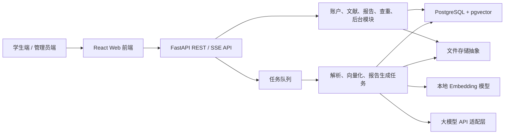

# “文渊”系统 MVP 阶段划分与技术栈讨论结果

## 1. 讨论范围

本文仅讨论“文渊——大学生文献知识库归档与报告文档智能生成系统”的程序功能、实现阶段、系统架构和技术栈，不包含开发日期、人员分工、答辩、PPT 或说明书编写安排。

题目的核心不是做一个通用聊天页面，而是实现以下三个能够展示自主设计的业务闭环：

1. 文献上传、解析、切片、向量化、检索；
2. 模板选择、资料检索、结构化报告生成、来源追溯；
3. 本地相似度计算、重复证据展示、定向润色和版本保存。

大模型 API 负责语言生成、摘要、关键词和润色；文献切片、检索编排、模板匹配、查重评分与版本管理由本系统自行实现。

## 2. MVP 边界

### 2.1 两种 MVP 口径

为了避免“MVP”一词产生歧义，采用两层定义：

- **核心 MVP**：证明系统的核心技术链路可用，即“上传文献 → 建库 → 检索 → 按模板生成报告 → 查看引用来源 → 查重 → 润色”。
- **题目完整 MVP**：在核心 MVP 上补齐账户、历史版本、基础管理员端、模板配置、敏感词与审计日志，覆盖题目列出的基本功能。

核心 MVP 对应阶段 0 至阶段 3；题目完整 MVP 对应阶段 0 至阶段 4。

### 2.2 MVP 必须包含

- 账号密码注册、登录和用户数据隔离；
- PDF、Markdown、TXT 上传；
- 文献解析状态、失败原因和重试能力；
- 文献分类、归档、搜索和删除；
- 自主实现的文本清洗、分块、向量化和 Top-K 检索；
- 至少两种报告模板，例如开题报告、文献综述；
- 基于用户私有知识库的分章节报告生成；
- 生成内容与知识片段之间的可追溯引用；
- 报告编辑、自动保存、历史版本和 DOCX 导出；
- 基于私有知识库的本地相似度检测和标红证据；
- 针对选中段落的多风格润色，并保存为新版本；
- 管理员管理用户、模板、提示词、敏感词和操作日志。

### 2.3 MVP 明确不包含

- 公网论文库查重。没有合法、稳定的数据源时，不应宣称具有权威查重能力；MVP 的准确名称应为“私有语料相似度检测”。
- 扫描版 PDF 的 OCR。MVP 仅保证处理包含文本层的 PDF，扫描件显示“不支持或待 OCR”。
- 邮箱验证码登录、找回密码和第三方登录；
- 多人实时协同编辑；
- 自动生成并插入数据图表；
- 跨语种全文翻译；
- 引用一比一完整性校验；
- 学术热点大屏；
- 对象存储集群、微服务、Kubernetes 等超出当前体量的基础设施。

这些内容进入后续增强池，不阻塞题目完整 MVP。

## 3. 总体架构结论

采用“前后端分离的模块化单体 + 独立后台任务进程”。模块化单体便于保持业务边界，也避免过早引入微服务通信和分布式一致性成本。



### 3.1 模块边界

- `auth`：注册、登录、令牌刷新、角色和账号状态；
- `knowledge_base`：知识库、文献、标签、解析任务、文本片段和向量；
- `retrieval`：关键词检索、向量检索、结果融合和权限过滤；
- `template`：报告模板、章节规则、提示词版本和生成参数；
- `report`：报告生成、编辑、引用、版本、历史搜索和导出；
- `similarity`：切句、候选召回、相似度评分、证据和总体统计；
- `llm`：不同大模型供应商的统一接口、流式输出、超时和错误映射；
- `admin`：用户、敏感词、模板配置和审计日志。

模块之间通过应用服务接口调用，禁止控制器直接拼 SQL、直接调用大模型或直接操作向量表。

## 4. MVP 阶段划分

阶段按依赖关系和可验收结果划分，不代表日期安排。

### 阶段 0：工程骨架与领域契约

**状态**：已由用户验收通过。前端端口固定为 `7777`，后端端口固定为 `4396`，仓库根目录提供一键启动脚本。

**目标**：先建立能够持续扩展的前后端骨架，并固定关键数据和接口契约。

**程序内容**：

- 前后端项目初始化、统一代码格式、环境变量和错误码；
- PostgreSQL、pgvector、数据库迁移和本地文件目录；
- 用户、知识库、文献、片段、模板、报告、版本、引用、任务、审计日志的基础数据模型；
- OpenAPI 接口契约及前端 API 类型生成；
- 健康检查、结构化日志和全局异常处理；
- 大模型、Embedding、文件存储三个适配器接口，业务层不绑定具体供应商。

**验收门槛**：

- 前后端均可启动；
- 数据库迁移可从空库完整执行；
- 前端能调用后端健康检查；
- 配置缺失时给出明确错误，而不是启动后静默失败。

### 阶段 1：私有知识库闭环

**状态**：程序实现、自动化验收及用户测试修复已完成，进入稳定维护状态。

当前离线开发基线使用自研的 512 维字符 n-gram 哈希向量器，以保证无网络环境也能完整演示切片、入库和 pgvector 检索。该实现遵守 Embedding 端口契约，替换为 `BAAI/bge-small-zh-v1.5` 时不改变业务接口或数据隔离逻辑。

**目标**：用户能够把文献变成可检索的私有知识资产。

**程序内容**：

- 账号密码注册、登录、退出和个人基本信息；
- 创建知识库，上传 PDF、Markdown、TXT；
- 校验扩展名、MIME、文件大小和内容哈希，避免同一知识库重复上传；
- 提取正文、页码或标题层级，统一换行和空白；
- 按标题优先、长度兜底的策略分块，并保留相邻重叠；
- 使用本地 Embedding 模型生成向量并写入 pgvector；
- 文献列表、处理状态、摘要、关键词、删除和重新处理；
- “检索测试台”：输入问题并显示 Top-K 文本、文献名、页码/段落、相似度。

**自主实现重点**：

- 分块策略建议以 500～800 个中文字符为目标，保留约 80～120 字重叠；参数配置化，不把数值散落在代码中；
- 查询必须先按 `user_id` 和 `knowledge_base_id` 过滤，再计算相似度；
- 记录 `embedding_model`、向量维度、分块参数和处理版本，模型变化时可重建；
- 文献删除必须同步删除片段、向量和对应文件。

**验收门槛**：

- 三种格式各有成功样例；
- 上传后状态能经历“等待、处理中、成功/失败”；
- 能从多篇文献中检索出与问题相关且来源正确的片段；
- 不同用户无法访问或检索对方文献。

### 阶段 2：RAG 报告生成闭环

**状态**：程序实现、素材端到端验收、生产构建及用户验收已完成，进入稳定维护状态。

在未配置大模型凭据的离线环境中，系统使用“证据摘取草稿器”完成可复现演示，只组织本次检索得到的片段并生成有效引用；配置 `LLM_BASE_URL`、`LLM_API_KEY` 和 `LLM_MODEL` 后自动切换为 OpenAI 兼容接口。两种模式共用引用编号校验，超出本次证据范围的编号会被移除。

**目标**：从私有知识库生成有结构、有证据、可编辑的报告初稿。

**程序内容**：

- 两种内置模板，每个模板由章节、章节说明、必填输入和生成顺序组成；
- 用户填写课题名称、研究目标等变量并选择知识库；
- 按章节生成检索查询，分别召回资料；
- 组装包含模板约束、用户输入、检索证据和引用编号的提示词；
- 按章节调用大模型，使用 SSE 流式显示生成进度；
- 报告以结构化 Markdown 保存，引用单独建表，不只嵌在正文字符串中；
- 点击引用可查看原文、文献名及页码/段落；
- 报告编辑、自动保存、历史搜索、版本快照和 DOCX 导出；
- 失败章节可单独重试，不重新生成整篇报告。

**自主实现重点**：

- 不把整库文本直接塞给大模型；每个章节独立检索并限制上下文预算；
- 大模型输出中的引用编号必须来自本次检索证据，无法映射的编号视为无效引用；
- 生成任务保存提示词版本、模型名、检索结果和参数，保证问题可复现；
- 模板匹配采用明确规则，例如模板类型、必填字段、章节顺序和适用学科标签，而不是让大模型任意决定结构。

**验收门槛**：

- 能基于至少两篇文献生成完整报告；
- 每个有资料支撑的章节能展示来源；
- 无相关证据时明确提示资料不足，不编造引用；
- 页面刷新后报告、进度结果和历史版本仍可恢复；
- 可导出可正常打开的 DOCX。

完成本阶段后，系统已经形成最小的“知识库 → 报告”垂直闭环。

### 阶段 3：相似度检测、润色与学术助手闭环

**状态**：程序实现、算法分层样例、真实数据库端到端验收、生产构建及用户验收已完成，进入稳定维护状态。

**目标**：补齐题目最有辨识度的查重和人机修改链路，形成核心 MVP。

**程序内容**：

- 把待检测报告按句子和段落切分；
- 使用字符 n-gram TF-IDF + Cosine Similarity 实现确定性的本地查重；
- 可选增加 Embedding 余弦相似度作为语义辅助分，但不替代可解释的词面证据；
- 为每个高相似片段保存匹配文献、原文片段、分数和高亮区间；
- 汇总“高相似文本占比”，而不是伪装成权威平台查重率；
- 对选中片段提供“学术严谨、通俗表达、精简”三种润色风格；
- 润色前后并排对比，由用户确认后写入新版本；
- 提供“严谨导师”和“数据分析专家”两个预设角色，对当前报告或选中章节追问。

**推荐评分逻辑**：

1. 对待测句生成字符 2～4 gram 的 TF-IDF 向量；
2. 在当前用户选定知识库内进行余弦相似度匹配；
3. 取每句最高匹配结果，低于阈值的不标记；
4. 按待测文本字符长度加权计算总体高相似占比；
5. 阈值、ngram 范围和最低句长写入配置，并用固定样例校准。

这里应将“查重算法结果”和“大模型解释/润色”分开：分数由本地算法产生，大模型不能修改分数，也不能凭空生成匹配来源。

**验收门槛**：

- 对完全复制、轻微改写、无关文本三组样例给出符合预期的分层结果；
- 每个标红片段均能追溯到真实匹配原文；
- 润色失败不会覆盖原稿；
- 接受润色后自动产生新版本，可回退到润色前版本；
- 助手回答能引用当前知识库证据，并区分普通对话与修改建议。

### 阶段 4：基础管理员端与工程化收口

**状态**：管理员端、AI 配置预设、数据库迁移、自动化测试、生产构建及启用外部 LLM 的 MVP2～MVP4 回归验收均已完成，并已由用户验收通过。题目完整 MVP 至此成立，后续进入基本功能补强、部署和增强阶段。

**目标**：补齐题目基本功能，并使系统达到稳定、可配置、可审计的题目完整 MVP。

**程序内容**：

- 管理员登录与角色鉴权；
- 用户列表、启用、禁用和用量查看；
- 报告模板版本发布后端能力，以及提示词、模型参数和向量参数的版本化预设配置；
- LLM 连接、附加请求参数和模型列表拉取，支持预设保存与快速切换；
- 按请求 `messages` 完整编排 system/user/assistant 消息，支持嵌套宏、排序、停用和提示词预设；
- Embedding 可在本地哈希基线与 OpenAI 兼容第三方接口间切换，预设独立保存；
- LLM 可选择绑定提示词和向量预设；绑定只在切换时同步，三类预设仍可独立切换；
- 敏感词分组、独立启停、增删修改、批量导入以及上传/生成后的扫描；
- 管理员关键操作审计与按操作名称搜索；
- 服务器 CPU、内存和进程占用监控，以及可按级别筛选的应用日志；
- 文件类型、大小、路径和内容安全校验；
- 大模型调用超时、失败重试和错误提示；
- 解析、向量化、生成任务的幂等处理；
- 核心服务单元测试、上传—生成—查重集成验证，以及启用外部 LLM 的脱敏验收产物；
- 管理员控制台主要界面重制，完善已有条目的选择、编辑、删除、放弃修改、同名覆盖确认和快速切换逻辑；
- 关键页面的空状态、错误状态、加载状态与移动端布局。

**范围控制**：

- 管理端优先保证功能完整，不单独建设一套技术架构；复用同一 React 应用和 FastAPI 服务，通过路由与权限区分；
- 敏感内容命中后先进入“标记/限制使用”状态，不在 MVP 中自动物理删除用户文件；
- `API Key` 可由管理员以只写方式配置，使用服务端派生密钥加密落库；接口只返回“已配置”状态，不回传明文。

**验收门槛**：

- 被禁用用户无法继续获取有效会话；
- 模板发布新版本后不影响旧报告复现；
- 管理员操作均有操作者、对象、动作、时间和结果记录；
- 重复提交任务不会产生重复报告、片段或向量；
- 核心流程的失败状态均可见且可恢复。

**验收后边界**：

- 管理员报告模板目前具备版本发布后端能力，但尚未形成完整的模板列表、新建、编辑、删除和章节排序界面；
- 敏感词扫描会在文献与报告中保存命中结果，但管理员审核队列、下架、恢复、封禁和审核意见尚未形成闭环；
- 校园公告、个人资料完善、多主题切换、国标参考文献列表和引用一比一校验尚未实现；
- 文献解析与报告生成仍使用 API 进程内后台任务，当前 `compose.yaml` 只负责 PostgreSQL，本阶段不代表已经具备正式公网部署能力；
- 上述内容不影响 MVP4 验收结论，统一进入后续工作清单。

### 阶段 5：MVP 后增强池

阶段 5 不再按单一功能顺序推进，而是分为四层：

1. **题目基本功能补强**：模板管理、内容审核、校园公告、国标参考文献与引用校验；**状态：已完成程序实现、迁移、自动化测试和生产构建验证。**
2. **体验与运维完善**：个人资料、多主题、用量统计、审计筛选导出、错误码速查和历史日期分组；**状态：已完成程序实现、迁移、自动化测试和生产构建验证。邮箱验证码与找回密码需在部署环境配置 SMTP 后启用。**
3. **稳定性与云端部署**：独立任务 Worker、完整 Docker Compose、持久化存储、HTTPS、备份和生产配置；
4. **加分增强**：混合检索与 reranker、OCR、多语种解析、实验图表和热点数据看板。

详细执行顺序、验收标准和暂缓项见仓库根目录的《后续工作优先级.md》。在题目基本功能补强后，应优先完成云端部署，再选择高价值加分功能，避免继续横向堆叠功能而没有可公开访问的稳定版本。

## 5. 技术栈结论

### 5.1 前端

| 层次 | 选择 | 原因 |
| --- | --- | --- |
| 框架 | React + TypeScript + Vite | 团队偏好 React；生态完整，适合构建文献工作台和管理后台 |
| 路由 | React Router | 统一承载学生端、管理员端和权限路由 |
| 服务端状态 | TanStack Query | 统一处理请求缓存、失效、重试和任务状态轮询 |
| 客户端状态 | Zustand（按需） | 仅保存主题、编辑器临时状态等跨组件本地状态，避免重复缓存服务端数据 |
| UI 与样式 | Tailwind CSS + shadcn/ui | 样式可控，适合形成区别于通用后台模板的学术视觉风格 |
| HTTP | Fetch 封装 | 统一处理令牌刷新、错误结构和请求取消，减少非必要依赖 |
| 流式生成 | 原生 `EventSource` 或基于 Fetch 的 SSE | 单向生成流比 WebSocket 更简单；需要 POST 时使用 Fetch 读取流 |
| 编辑与预览 | Markdown 编辑器 + Markdown 渲染 | 报告内部以 Markdown/结构化章节保存，降低富文本序列化难度 |
| 图表 | ECharts，仅用于必要统计 | 不作为核心 MVP 依赖 |

前端使用一个 React 应用承载学生端和管理员端。主题通过 CSS Variables 与 Tailwind Design Tokens 实现，只做浅色/深色两套稳定主题，不为“多主题”引入复杂换肤框架。

### 5.2 后端

| 层次 | 选择 | 原因 |
| --- | --- | --- |
| Web API | Python + FastAPI | 与文本处理、Embedding 和机器学习生态衔接自然；支持文件上传和异步接口 |
| 数据校验 | Pydantic | 请求、响应和配置模型统一 |
| ORM/迁移 | SQLAlchemy 2.x 稳定版 + Alembic | 数据模型明确，迁移可追踪；不采用预览版 |
| 文档解析 | pypdf + Python 标准库 | 覆盖文本型 PDF、TXT、Markdown；先控制解析范围 |
| DOCX 导出 | python-docx | 适合按模板生成可编辑文档 |
| 本地查重 | scikit-learn | 直接实现 TF-IDF、字符 n-gram 和余弦相似度 |
| Embedding | sentence-transformers + 可配置中文轻量模型 | 可本地运行并展示自主向量化链路 |
| 密码 | Argon2 密码哈希库 | 禁止明文或可逆加密保存密码 |
| 测试 | pytest + httpx | 覆盖服务、API 和关键算法 |

不建议在核心链路中直接使用 LangChain 的整套 RAG Chain。可以借用独立工具函数，但文献分块、检索、提示词组装、引用映射和任务状态应由项目代码显式实现，便于解释、测试和展示自主性。

### 5.3 数据与存储

| 层次 | 选择 | 原因 |
| --- | --- | --- |
| 关系数据库 | PostgreSQL | 同时承载账户、文献、报告、版本和审计数据 |
| 向量检索 | pgvector | 向量与文献权限元数据放在同一事务和查询体系内，减少额外服务 |
| 向量索引 | MVP 小数据量先精确检索；数据增长后启用 HNSW | 先保证结果可验证，再按数据量优化 |
| 关键词搜索 | PostgreSQL 全文搜索或受控 `ILIKE` | MVP 不额外引入 Elasticsearch |
| 文件存储 | 本地目录 + `FileStorage` 接口 | 当前部署简单，未来可替换为 MinIO/S3 而不改业务层 |
| 缓存/队列 | 当前使用数据库任务表与进程内后台任务；阶段 5/P1 迁移至 Redis + RQ/Dramatiq 或同类队列 | 解析和生成任务需要可重试、可恢复，云端部署前再引入独立 Worker |

FastAPI 自带后台任务适合较轻、同进程任务；文献解析、Embedding 和长报告生成属于较重任务。MVP0～MVP4 已使用数据库任务表记录状态并由 API 进程执行后台任务；云端部署前应迁移至独立 Worker，避免服务重启导致任务执行中断。

#### 数据库方案比较与决策

| 维度 | SQLite + ChromaDB | PostgreSQL + ChromaDB | PostgreSQL + pgvector |
| --- | --- | --- | --- |
| 部署 | 两套本地存储，原型启动较轻 | 两个独立数据库服务 | 一个数据库服务和一个扩展 |
| 关系业务 | 适合单机、低写并发 | 完整 | 完整 |
| 向量能力 | Chroma 开箱即用 | Chroma 开箱即用 | 精确检索、HNSW、IVFFlat、Cosine 等能力足够 |
| 一致性 | 业务记录与向量需应用层同步 | 跨服务无法共享事务 | 文献、片段和向量可在同一事务中维护 |
| 权限过滤 | 需向 Chroma 复制用户和知识库元数据 | 需向 Chroma 复制用户和知识库元数据 | 可直接使用 SQL 关联和所有权条件 |
| 删除/重建 | 容易产生孤立向量 | 需要补偿任务 | 可用外键、级联和事务保证 |
| 并发 | SQLite 单写者可能限制 worker 和自动保存 | 较好 | 较好 |
| 备份恢复 | 需协调两个数据目录 | 需协调两个服务 | 一套一致性备份 |
| 适用场景 | 单用户、本地 RAG 原型 | 向量服务需要独立扩展 | 多用户、强关系的 Web 业务系统 |

最终选择 **PostgreSQL + pgvector**。本系统的向量片段始终依附于用户、知识库、文献、报告引用和查重证据，统一存储能显著降低双写、权限泄漏和孤立数据风险，也更便于展示自主实现的向量化与检索过程。

ChromaDB 保留为替代方案，但只有在系统明确收缩为单用户本地原型，或未来向量服务需要独立扩展时再考虑。若使用 ChromaDB，业务库应优先选择 PostgreSQL，而不是 SQLite。

### 5.4 大模型适配

定义统一接口，而不是在业务服务中散落某家 API 的请求代码：

```text
LLMProvider
├── chat(messages, options) -> response
├── stream_chat(messages, options) -> token stream
└── health_check() -> provider status
```

首个实现选择一个支持 OpenAI 兼容接口的供应商；模型名、基础地址、超时、最大输出、温度等由服务端配置。生成建议低温度，润色可以稍高，但所有默认值均应由实际样例测试后确定。

Embedding 与生成模型分离：Embedding 默认使用本地模型，LLM 使用第三方 API。这样即使更换 LLM 供应商，已有向量库也不会被迫重建。

## 6. 核心数据结构

最低限度需要以下实体：

- `users`、`refresh_tokens`：账户、角色、状态和会话；
- `knowledge_bases`：用户私有知识库；
- `documents`：原文件、哈希、格式、解析状态、元数据；
- `document_chunks`：正文片段、顺序、页码/标题、token/字符数、向量、处理版本；
- `report_templates`、`template_versions`、`template_sections`：模板及版本化章节；
- `reports`、`report_versions`、`report_sections`：报告、快照和结构化章节；
- `citations`：报告章节与文献片段的显式关联；
- `similarity_jobs`、`similarity_matches`：查重任务、证据、分数和高亮范围；
- `background_jobs`：解析、向量化、生成等任务状态与幂等键；
- `sensitive_terms`、`audit_logs`：合规配置与后台操作记录。

所有核心业务表都要考虑 `user_id` 或可推导的所有权关系。仅依赖前端隐藏按钮不构成权限控制，后端的每次查询都必须执行所有权或角色校验。

## 7. 关键实现决策

### 7.1 报告保存格式

报告不能只保存为一整段 HTML。推荐以“报告 → 章节 → Markdown 内容”的结构保存，同时单独保存引用关系。这样便于局部重试、局部润色、版本比较、DOCX 导出和引用校验。

### 7.2 引用策略

- 每次章节生成前，为检索片段分配临时编号，如 `[S1]`、`[S2]`；
- 提示模型只能使用这些编号；
- 后端解析输出并将编号映射到 `document_chunk_id`；
- 无法映射的引用不入库，并在页面标记“引用无效”；
- 参考文献元数据不完整时要求用户补充，不让模型猜测作者、年份或期刊。

### 7.3 任务状态

统一状态为：`pending → running → succeeded/failed/cancelled`。任务需要进度、错误摘要、尝试次数、幂等键、创建和完成时间。生成和解析接口先返回任务 ID，前端轮询或订阅状态，不保持超长 HTTP 请求作为唯一状态来源。

### 7.4 安全底线

- 密码只保存强哈希；
- Refresh Token 使用 HttpOnly Cookie，Access Token 短时有效；
- 上传文件重命名为服务端生成的 ID，禁止直接使用用户文件名拼路径；
- 限制文件大小和格式，解析器异常不能拖垮 API 进程；
- 大模型 API Key 永不下发到浏览器；
- 向大模型发送内容前提示用户数据将交由第三方服务处理；
- 日志不得记录密码、Token、API Key 或完整私有文献正文。

## 8. 不采用的方案及原因

| 方案 | 结论 | 原因 |
| --- | --- | --- |
| 前后端都用同一个快速原型框架 | 不采用 | 难以满足题目明确的前后端分离要求，管理端和复杂交互扩展也受限 |
| 微服务 | 不采用 | 当前业务规模不需要，反而增加部署、鉴权、追踪和一致性成本 |
| MongoDB + 独立向量库 + Elasticsearch | MVP 不采用 | 三套存储增加维护面，PostgreSQL + pgvector 已覆盖当前需求 |
| 直接将整篇文献发送给 LLM | 不采用 | 成本和上下文不可控，也无法体现自主检索链路 |
| 全流程交给 LangChain Agent | 不采用 | 核心逻辑不透明，难以解释模板规则、检索证据和查重算法 |
| 用 LLM 直接给出“查重率” | 不采用 | 结果不可复现、不可校准、缺乏证据，不符合自主算法要求 |
| MVP 即支持扫描件 OCR | 暂不采用 | OCR、版面分析和表格恢复会显著扩大测试范围 |

## 9. 最终推荐基线

最终推荐以以下组合启动开发：

```text
Frontend: React + TypeScript + Vite + React Router + TanStack Query
          Tailwind CSS + shadcn/ui + Zustand（按需）
Backend:  Python + FastAPI + Pydantic + SQLAlchemy 2.x + Alembic
Database: PostgreSQL + pgvector
Parsing:  pypdf + Markdown/TXT parser
AI:       sentence-transformers local embedding + one LLM provider adapter
Check:    scikit-learn TF-IDF / char n-gram / cosine similarity
Export:   python-docx
Worker:   database-backed single worker first; Redis queue after core loop is stable
Test:     pytest + httpx; frontend component and critical flow tests
Deploy:   Docker Compose for web, API, worker and PostgreSQL
```

首个可验证目标不是做齐所有页面，而是跑通一条真实数据链：上传两篇文献，观察解析和切片，验证检索结果，按模板生成带来源的报告，再对报告运行本地相似度检测并保存润色后的新版本。该链路稳定后，再补齐管理员端与视觉细节。

## 10. 技术资料依据

- [React 官方 TypeScript 指南](https://react.dev/learn/typescript)：React 组件与 Hooks 可使用 TypeScript 建立类型契约。
- [Vite 官方指南](https://vite.dev/guide/)：用于 React 前端的开发服务器与构建。
- [FastAPI 文件上传文档](https://fastapi.tiangolo.com/tutorial/request-files/)：提供 `UploadFile` 等文件上传机制。
- [FastAPI 后台任务文档](https://fastapi.tiangolo.com/tutorial/background-tasks/)：官方同时说明重计算任务更适合独立任务工具/进程。
- [pgvector 官方仓库](https://github.com/pgvector/pgvector)：支持精确/近似近邻、Cosine Distance、HNSW 以及与 PostgreSQL 全文检索组合。
- [Chroma 架构文档](https://docs.trychroma.com/docs/overview/architecture)：说明 Collection、Database、Tenant 及其独立向量存储架构。
- [SQLite 官方适用场景](https://www.sqlite.org/whentouse.html)：说明其低配置优势以及单写者、服务端高并发方面的边界。
- [SQLAlchemy 2.0 官方文档](https://docs.sqlalchemy.org/en/20/)：本项目选用稳定的 2.x 线，不使用预览版作为 MVP 基线。
